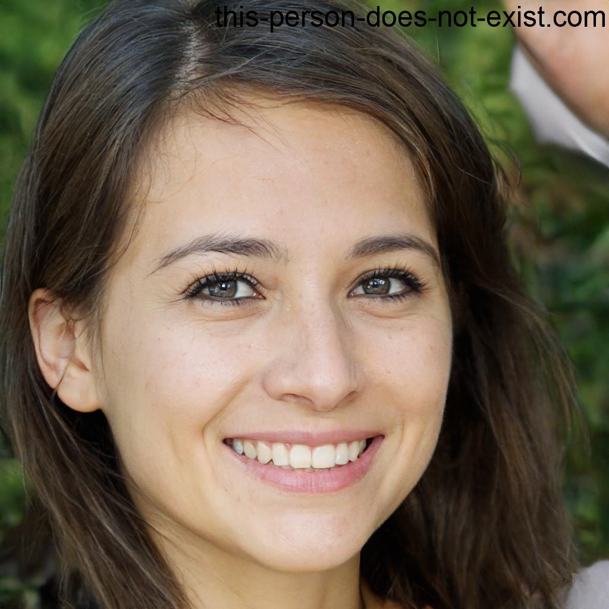

# <div align="center">Functional Specification</div>

## <div align="center">Team 3</div>

<div align="right">Author: <a href="https://www.github.com/pierre2103">Pierre GORIN</a></div>

_<div align="right">Last update: 25<sup>th</sup> of May 2023</div>_

<details>
    <summary>Table of Contents <b>Click to expand</b></summary>

- [Functional Specification](#functional-specification)
  - [Team 3](#team-3)
  - [Overview](#overview)
  - [Project Scope](#project-scope)
  - [Stakeholders](#stakeholders)
  - [Risks and Assumptions](#risks-and-assumptions)
  - [Requirements Specification](#requirements-specification)
  - [Solution Overview](#solution-overview)
  - [How it will works](#how-it-will-works)
    - [Setting Up Wine Blend Formulas and Tank Parameters](#setting-up-wine-blend-formulas-and-tank-parameters)
    - [Generating Instructions for the Blending Process](#generating-instructions-for-the-blending-process)
  - [What are the reasons to automate the process ?](#what-are-the-reasons-to-automate-the-process-)
  - [Personas](#personas)
    - [Persona 1](#persona-1)
    - [Persona 2](#persona-2)
    - [Persona 3](#persona-3)
    - [Persona 4](#persona-4)
  - [Use Cases](#use-cases)
    - [Use Case 1: Create a New Champagne Blend](#use-case-1-create-a-new-champagne-blend)
    - [Use Case 2: Check Resources Availability](#use-case-2-check-resources-availability)
    - [Use Case 3: Check Status of Tanks](#use-case-3-check-status-of-tanks)
    - [Use Case 4: Manage Champagne Production](#use-case-4-manage-champagne-production)
    - [Use Case 5: Carry Out Blending Process](#use-case-5-carry-out-blending-process)
  - [Terms and Definitions](#terms-and-definitions)

</details>

## Overview

The Krug Champagne House, in collaboration with LVMH, is developing winery software to streamline the blending stage of champagne production. The software's primary objective is to determine the right quantities of champagne required for blending Krug Grande Cuvée accurately, while ensuring no wastage and unwanted oxidation[^oxidation].

## Project Scope

The software's primary function is to determine the precise proportions of Champagne required for blending Krug Grande Cuvée. To achieve this, it must meet several requirements, including avoiding crashes and bugs from the algorithms, using only full or empty tanks[^tank] to prevent oxidation, producing a result closest to the specified formula, and being written in an idiomatic[^idiomatic] style that is easily readable and commented for easy understanding. Additionally, the software should achieve the desired result with a minimum number of steps and execute quickly.

- No crash and no bugs
- We must have only full or only empty tanks to avoid oxidation
- The final result must be the closest possible to the specified formula
- The code must be commented to be easily understandable
- The code must be in an idiomatic style to be easily readable
- The result must be find with the minimum number of steps possible
- The code's execution time must be the fastest possible

We need to be able to enter a number of input parameters including: the formula of the solution we want after blending, the resources we have at our disposal and their quantities, the number of tanks we have at our disposal and their quantities. In the output we will find the final solution, the exact composition or the closest possible composition to the starting one, a summary of the rest, as well as the full and empty tanks, and the number of movements* necessary to make the whole blending process.

*In this case a movement means the movement of a quantity of champagne from a tank A to a tank B.

## Stakeholders

| Stakeholder          | Role              | Description                                 | 🔗                                                 |
| -------------------- | ----------------- | ------------------------------------------- | ------------------------------------------------- |
| Krug Champagne House | Client            | Client of this project.                     | [Website](https://www.krug.com/)                  |
| Franck JEANNIN       | Project Overseer  | In charge of overseeing the entire project. | [Github](https://www.github.com/frje)             |
| Paul NOWAK           | Project Manager   | In charge of project management.            | [Github](https://www.github.com/PaulNowak36)      |
| Pierre GORIN         | Program Manager   | In charge of program management.            | [Github](https://www.github.com/pierre2103)       |
| Laura-Lee HOLLANDE   | Tech Lead         | In charge of technical aspects.             | [Github](https://www.github.com/lauraleehollande) |
| Mathis KAKAL         | Software Engineer | In charge of software development.          | [Github](https://www.github.com/mathiskakal)      |
| Rémy CHARLES         | Quality Assurance | In charge of project quality.               | [Github](https://www.github.com/RemyCHARLES)      |

## Risks and Assumptions

To mitigate risks, the development team must prioritize efficient project management, ensure thorough testing, and optimize code execution time.

| Risk                     | Impact                                                                                                                                                   | Mitigation                                                                                                           |
| ------------------------ | -------------------------------------------------------------------------------------------------------------------------------------------------------- | -------------------------------------------------------------------------------------------------------------------- |
| Software bugs or crashes | May impact the software's functionality, leading to manual blending and wastage of champagne                                                             | Thorough testing, commenting, and writing in an idiomatic style to enhance readability.                              |
| Project delays           | May lead to manual blending and loss of client trust                                                                                                     | Prioritizing efficient project management, optimization of the code's execution time.                                |
| Assumptions              | The blending process follows a precise formula that is easy to implement in the software and that there will be no changes to the formula in the future. | Consideration of these assumptions, ensuring the software's design is flexible enough to accommodate future changes. |
| Financial risks          | Cost of software development, maintenance, and licensing                                                                                                 | Conducting a cost-benefit analysis, establishing a budget for the project's entire lifecycle.                        |

## Requirements Specification

The requirement specifications for the software include a focus on the blending stage of the Krug Champagne House's winery process. The software must be designed to produce the closest result to the formula with the minimum number of steps. The software should optimize the use of 330 tanks of various sizes and a system of pumps and pipes to connect any tank with any other tank while ensuring that tanks are either completely full or completely empty to prevent oxidation. The software must also ensure that the wine is never in contact with oxygen.

## Solution Overview


## How it will works  

### Setting Up Wine Blend Formulas and Tank Parameters
The customer will provide a CSV file[^csv] with the following information:

- The percentage of wines in the final blend (e.g. 37% of wine 1, 45% of wine 2, 18% of wine 3)
- The number of tanks, their capacity and what they are filled with (e.g. 2 empty tanks of 100hL each, 1 tank of 100hL filled with wine 2, 1 tank of 50hL filled with wine 1, 1 tank of 50hL filled with wine 3, 2 tanks of 50hL each filled with wine 1)

The structure of the CSV file will be as follows:
|                 |     |     |     |     |
| --------------- | --- | --- | --- | --- |
| Id              | 1   | 2   | 3   |     |
| Percentage      | 37  | 45  | 18  |     |
| Number of tanks | 2   | 1   | 1   | 1   | 2  |
| Capacity        | 100 | 100 | 50  | 50  | 50 |
| Id of wine      | 0   | 2   | 2   | 3   | 1  |

Lines "Id" and "Percentage" represent the formula, and lines "Number of tanks", "Capacity" and "Id of wine" represent the tanks.

To be more precise, we define how many type of wine there is in our final blend, and we assign to each an Id, the Id is a integers that start at 1 and increment by 1 for each new type of wine. Then we define the percentage of each wine in the final blend, to do it we enter the number in percent below the Id of the wine. Be careful the sum of the percentage must be equal to 100, if it's not the software will say it to you.

In the tanks section (lines 3 to 5), we'll define the properties of each tank in columns, first the number of tanks, then the capacity of these tanks in hectolitres, and below that the Id of the wine in this tank. The wine Id is the same as the wine Id in the formula. If the tank is empty, we'll put 0 in the wine Id.

So in the example above the list of tanks will be as follows:


### Generating Instructions for the Blending Process

After loading the CSV file, the software will execute the blending process and generate a text file with detailed instructions. The instructions will include the following information:

- Number of Steps: The total number of steps required for the blending process.

- Step Details: A breakdown of each step, providing clear instructions. For example, "Step 1: Connect tank 1 to tank 2 and connect tank 3 to tank 4."

- Blend Accuracy: The accuracy of the blend compared to the expected formula. This will be presented as the expected blend formula (e.g., Wine 1 = 37%, Wine 2 = 45%, Wine 3 = 18%) and the actual blend formula achieved by the software (e.g., Wine 1 = 33%, Wine 2 = 48%, Wine 3 = 19%). Additionally, the accuracy percentage will be provided (e.g., Accuracy: 91.2%).

- Wine Quantity Produced: The total quantity of wine produced during the blending process. This will be specified in hectoliters (e.g., "Quantity of wine produced: 200hL").

- Wine Loss Due to Oxidation: The quantity of wine lost due to oxidation. If no wine is lost, it will be indicated as "Quantity of wine lost: 20hL".

- Tank Conditions: The condition of each tank involved in the process. Tanks will be categorized as empty, containing wine that can still be used, containing oxidized wine or containing the final blending.

The output file will be as follows:
```
Number of Steps: 5

Step Details:
 - Step 1: Connect tank 1 to tank 2.
 - Step 2: Connect tank 3 to tank 4.
 - Step 3: Empty tank 1 and fill it with wine 2.
 - Step 4: Empty tank 3 and fill it with wine 3.
 - Step 5: Connect tank 1 to tank 3.

Blend Accuracy:
 - Expected formula: Wine 1 = 37%, Wine 2 = 45%, Wine 3 = 18%
 - Actual formula: Wine 1 = 33%, Wine 2 = 48%, Wine 3 = 19%
 - Accuracy: 91.2%

Wine Quantity Produced: 250hL

Wine Loss Due to Oxidation: 0hL

Tank Conditions:
 - Tank 1: Contains the final blend.
 - Tank 2: Contains wine 2.
 - Tank 3: Contains wine 3.
 - Tank 4: Empty.
```

## What are the reasons to automate the process ?

Blending plays a crucial role in the creation of champagne and holds significant importance in the production process. This intricate procedure demands substantial time and expertise. A team of proficient individuals conducts the blending, meticulously tasting different wines to determine the ideal combination for the ultimate product.

Afterward, the challenge lies in replicating this precise blend on a larger scale. However, accomplishing this task proves arduous due to the inherent loss and variation that occurs during manual blending.

Employing an effective algorithm can enhance the quality and consistency of the final champagne, bringing it closer to the authentic recipe and resulting in a superior taste.

## Personas

### Persona 1



<ins>**Name:**</ins> _Isabelle Dubois_

<ins>**Profession:**</ins> _Cellar Master_

<ins>**Needs:**</ins> _The cellar master is responsible for overseeing the storage and preservation of champagne. They need efficient tools to manage the status of tanks, ensure proper utilization to prevent oxidation, and monitor the blending process._

<ins>**Pain Points:**</ins>
_Isabelle faces challenges in tracking the status of tanks (full or empty) and ensuring they are utilized correctly. They also need to prevent oxidation and maintain the quality of the champagne throughout the blending process._

<ins>**Personality:**</ins><br>

```
Introverted ├─────────────🔘───────────────────┤ Extraverted
Spontaneous ├───────────────────────────🔘─────┤ Organized
Analytics   ├───────────────🔘─────────────────┤ Creative
```

<ins>**Tech Skills:**</ins><br>

```
Internet*  :   ⭐⭐⭐⭐
Smartphone :   ⭐⭐⭐⭐
Computer** :   ⭐⭐⭐⭐

*This part defines the ability to navigate through the internet and its websites.
**This part defines the ability to navigate through a computer and its softwares.
```

### Persona 2


<ins>**Name:**</ins> _Alexandre Moreau_

<ins>**Profession:**</ins> _Winemaker_

<ins>**Needs:**</ins> _Alexandre wants to create new champagne blends using efficient software. They require precise calculations, utilization of available resources (tanks), and the ability to produce blends closest to the desired formula._

<ins>**Pain Points:**</ins>
_The winemaker faces challenges in determining the precise proportions of champagne required for blending and achieving the desired result. They also need to ensure the software is reliable and avoids crashes or bugs._

<ins>**Personality:**</ins><br>

```
Introverted ├───────────────────🔘─────────────┤ Extraverted
Spontaneous ├───────🔘─────────────────────────┤ Organized
Analytics   ├────────────────────────────🔘────┤ Creative
```

<ins>**Tech Skills:**</ins><br>

```
Internet*  :   ⭐⭐
Smartphone :   ⭐⭐⭐⭐
Computer** :   ⭐⭐⭐

*This part defines the ability to navigate through the internet and its websites.
**This part defines the ability to navigate through a computer and its softwares.
```

### Persona 3


<ins>**Name:**</ins> _Sophie Laurent_

<ins>**Profession:**</ins> _Production Manager_

<ins>**Needs:**</ins> _The production manager is responsible for overseeing the entire champagne production process. They require a software solution that can efficiently manage and monitor the blending process, including tracking the number of movements required to transfer champagne between tanks._

<ins>**Pain Points:**</ins>
_Sophie faces challenges in coordinating the blending process and ensuring efficient movement of champagne between tanks. They need to monitor the progress and ensure the blending is carried out with the minimum number of steps._

<ins>**Personality:**</ins><br>

```
Introverted ├──────────────────🔘──────────────┤ Extraverted
Spontaneous ├─────────────────────────🔘───────┤ Organized
Analytics   ├────🔘────────────────────────────┤ Creative
```

<ins>**Tech Skills:**</ins><br>

```
Internet*  :   ⭐⭐⭐⭐
Smartphone :   ⭐⭐⭐⭐⭐
Computer** :   ⭐⭐⭐⭐

*This part defines the ability to navigate through the internet and its websites.
**This part defines the ability to navigate through a computer and its softwares.
```

### Persona 4


<ins>**Name:**</ins> _Jean Martin_

<ins>**Profession:**</ins> _Production Agent_

<ins>**Needs:**</ins> _The production agent is responsible for carrying out the blending process. He require a software solution that can efficiently guide them through the process and help him to know how to connect each tanks._

<ins>**Pain Points:**</ins>
_Jean faces challenges in carrying out the blending process and connecting the tanks. He need to know which tanks to connect and in which order to ensure the blending is carried out correctly._

<ins>**Personality:**</ins><br>

```
Introverted ├──────────────────────🔘──────────┤ Extraverted
Spontaneous ├──────────────────────────🔘──────┤ Organized
Analytics   ├──────────────🔘──────────────────┤ Creative
```

<ins>**Tech Skills:**</ins><br>

```
Internet*  :   ⭐⭐
Smartphone :   ⭐⭐
Computer** :   ⭐⭐

*This part defines the ability to navigate through the internet and its websites.
**This part defines the ability to navigate through a computer and its softwares.
```

## Use Cases

### Use Case 1: Create a New Champagne Blend

<ins>**Actor:**</ins> _Alexandre Moreau (Winemaker)_

<ins>**Scenario:**</ins> _The Winemaker wants to create a new champagne blend using the software. They enter the desired blend formula, the available resources (tanks, their quantities), and their respective amounts. The software then calculates the precise amount of champagne required for blending, ensures that only full or empty tanks are used to prevent oxidation, and produces a final blend closest to the desired formula._

<ins>**Success Criteria:**</ins> _The software provides the winemaker with a champagne blend closest to the desired formula with the minimum number of steps and without any software crashes._

### Use Case 2: Check Resources Availability

<ins>**Actor:**</ins> _Alexandre Moreau (Winemaker)_

<ins>**Scenario:**</ins> _The Winemaker needs to check the availability of resources (tanks) before creating a new champagne blend. They input the number of tanks required and their respective capacities. The software then checks the availability of the required tanks and their respective quantities (full or empty)._

<ins>**Success Criteria:**</ins> _The software displays the availability of the required tanks and their respective quantities (full or empty)._

### Use Case 3: Check Status of Tanks

<ins>**Actor:**</ins> _Isabelle Dubois (Cellar Master)_

<ins>**Scenario:**</ins> _The Cellar Master needs to check the status of tanks (full or empty) to ensure they are correctly utilized to prevent oxidation. They input the number of tanks required and their respective capacities. The software then checks the status of the required tanks and their respective quantities (full or empty)._

<ins>**Success Criteria:**</ins> _The software displays the status of the required tanks and their respective quantities (full or empty)._

### Use Case 4: Manage Champagne Production

<ins>**Actor:**</ins> _Sophie Laurent (Production Manager)_

<ins>**Scenario:**</ins> _The Production Manager needs to monitor the blending process, including the number of movements required to transfer the champagne from one tank to another. They input the number of movements and their respective tanks. The software then calculates the number of movements required and monitors the entire blending process._

<ins>**Success Criteria:**</ins> _The software displays the number of movements required and monitors the entire blending process._

### Use Case 5: Carry Out Blending Process

<ins>**Actor:**</ins> _Jean Martin (Production Agent)_

<ins>**Scenario:**</ins> _The Production Agent needs to carry out the blending process. He know the final formula, and the tanks he has at his disposal. He need to have a list of step to follow to complete the blending process._

<ins>**Success Criteria:**</ins> _The software displays the correct list of steps to follow to complete the blending process._

## Terms and Definitions

[^tank]: A sizable container primarily utilized for storing and holding a significant amount of liquid or gas.

[^oxidation]: The process of oxygen reacting with a substance.

[^idiomatic]: A style of writing code that is easily readable and understandable.

[^csv]: a file that allows data to be saved in a table structured format.
