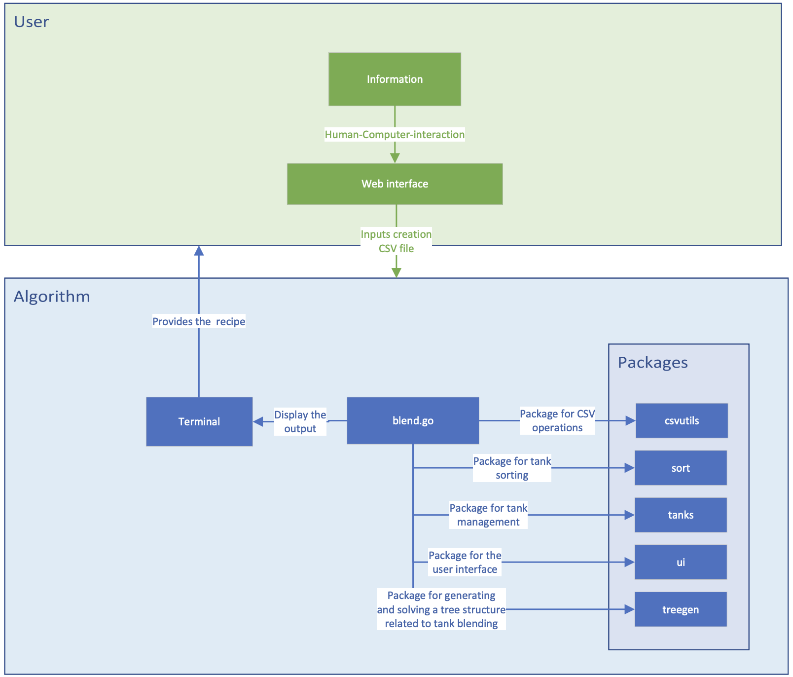

# Technical Specifications

<details>

<summary>
Table of content
</summary>

- [Technical Specifications](#technical-specifications)
  - [Introduction](#introduction)
    - [Context and goals](#context-and-goals)
      - [Context](#context)
      - [Goals](#goals)
    - [Project overview](#project-overview)
    - [Point of contact](#point-of-contact)
  - [Functional requirements](#functional-requirements)
    - [Description of the system's functionalities](#description-of-the-systems-functionalities)
    - [System use cases](#system-use-cases)
    - [Performance requirements](#performance-requirements)
    - [Security requirements](#security-requirements)
  - [System architecture](#system-architecture)
    - [System architecture overview](#system-architecture-overview)
    - [System components](#system-components)
      - [Algorithm blending](#algorithm-blending)
      - [User interface](#user-interface)
    - [Technologies and tools used](#technologies-and-tools-used)
      - [Language used](#language-used)
      - [Package used](#package-used)
        - [csvutils package](#csvutils-package)
        - [sort package](#sort-package)
        - [tanks package](#tanks-package)
        - [treegen package](#treegen-package)
        - [ui package](#ui-package)
      - [Other tools used](#other-tools-used)
    - [System architecture diagram](#system-architecture-diagram)
    - [Folders structure](#folders-structure)
  - [Features specifications](#features-specifications)
    - [Execution](#execution)
    - [User Interface Specifications](#user-interface-specifications)
  - [Test and validation](#test-and-validation)
  - [Glossary](#glossary)

</details>

## Introduction

This document completes the Functional Specifications by bringing a more technical side of the design of our solution. Moreover for all the elements concerning the tests, this document will be supplemented by the Test Plan which contains all our approach of test on this project.
It is important to take into account these three documents together for a better understanding of our solution.

### Context and goals

#### Context

Krug Champagne (part of LVMH) is building a new winery and needs a software solution for their blending process. The traditional method for making champagne involves several complex steps, and blending is a critical step in creating a consistent flavor profile. The challenge is to blend large quantities of wine in the right proportions while minimizing the number of steps to produce the closest result to the formula. The software solution will need to leverage the 330 tanks of various sizes and a system of pumps and pipes that can connect any tank with any other tank.

#### Goals

The main objectives of the project are:

- To develop a software solution that automates the blending process of champagne production, with the aim of minimizing the number of steps required to achieve the closest result to the target formula.

- To leverage the available resources such as the 330 tanks of various sizes and the system of pumps and pipes to create a flexible and scalable solution that can adapt to different production volumes.

- To ensure that the software solution is easy to use, with a user-friendly interface that enables the Cellar Master and her team to experiment with different combinations of wines and track the progress of the blending process.

- To ensure the correctness of the software solution, with no crashes or errors, and that it meets the quality standards of Krug Champagne.

- To optimize the speed of the software solution, to minimize the time required for blending and improve the overall efficiency of the production process.

- To document the software solution and provide adequate instructions to the Cellar Master and her team to ensure a smooth transition to the new system.

These objectives will guide the development and implementation of the software solution and ensure that it meets the needs and expectations of Krug Champagne.

### Project overview

Reminder of the project elements:

- **Project Name:** Algorithmics Krug Champagne

- **Client:** Krug Champagne, part of LVMH

- **Project Description**

  - The software will be used for the new winery of Krug Champagne to assist with the blending process of champagne. The software will focus on the blending task described as follows: **"Blending: The still wines from different vineyards and grape varieties are blended together to create a consistent flavor profile."** The goal of the software is to produce the closest result to the desired formula with the minimum number of steps.

- **Scope**

  - The software will include a user interface that will allow the cellar master and her team to input the desired formula for the champagne blend. The software will then analyze the available wines and recommend the optimal combinations of wines to achieve the desired formula. The software will also manage the transfer of wine between tanks during the blending process, ensuring that the tanks are never partially full to prevent oxidation. The software will need to manage the inventory of the wine and tanks and ensure that the blending process is conducted efficiently and accurately.

- **Deliverables**

  - The software will be delivered as a desktop application that can be installed on the winery's computers. The software will be designed to run on Windows, Mac, and Linux operating systems. The application will have a user-friendly interface that will allow the cellar master and her team to easily input the desired formula and view the recommended wine combinations.

- **Timeline**

  - The project is expected to be completed by June 23, 2023, with at least one week allotted for testing and bug fixing.

- **Budget**

  - As no budget has been specified by the client, and we do not anticipate incurring any expenses, this project is expected to have no budgetary constraints.

### Point of contact

| Person               | Role              | Contact              |
|----------------------|-------------------|----------------------|
| Paul Nowak           | Project manager   | Groupe server, Slack |
| Mathis Kakal         | Software engeener | Groupe server, Slack |
| Rémy Charles         | Quality assurance | Groupe server, Slack |
| Pierre Gorin         | Program Manager   | Groupe server, Slack |
| Laura-Lee Hollande   | Tech Lead         | Groupe server, Slack |
| Franck Jeannin       | Project overseer  | Slack                |
| Krug Champagne House | Client            | Franck Jeannin       |

## Functional requirements

### Description of the system's functionalities

- **The system will allow users to**

  - View and manage tank inventory, including tank size and contents
  - Generate production plans based on wine blend formulas and tank inventory
  - Track wine production and blending process in real-time
  - Generate reports on production data and inventory levels

- **Tank management functionality**

  - Add and remove tanks from the system
  - Assign tanks to specific wine types or blends
  - View tank inventory and contents
  - Set tank capacity and volume thresholds for notifications

- **Production planning functionality**

  - Create production plans based on wine blend formulas and inventory levels
  - Set target production quantity and dates
  - Allocate tanks and volumes to the production plan
  - Generate and assign work orders to workers for wine blending and production

- **Production Monitoring Functionality**

  - Track wine production and blending process in real-time
  - Set alerts for out-of-range values

- **Reporting functionality**

  - Generate production reports based on selected parameters
  - View inventory reports and trends over time
  - Track production costs and margins
  - Analyze production data to optimize processes and identify areas for improvement

### System use cases

Suppose the Cellar Master has determined the perfect wine blend formula to produce Krug Grande Cuvée. This formula involves using different volumes of wine from different tanks. Our software system can be used to facilitate the production process by helping cellar workers to efficiently blend the required volumes of wine from the different tanks.

The system can generate a production plan that specifies the required volumes of each wine to be blended to produce the total amount of Krug Grande Cuvée needed. The cellar workers can then use the system to locate the appropriate tanks and pump the required volumes of wine into the blending tanks. The system can also monitor the blending process to ensure that the correct volumes of each wine are mixed together to produce the perfect blend.

By using this system, the wine blending process can be carried out quickly and efficiently, saving time and resources while ensuring the quality and consistency of the final product.

### Performance requirements

- **Response time:** The desired response time for the program to process and generate the instructions could be defined as an acceptable duration within which the program should provide the results to the user.

- **Scalability:** If scalability is a requirement, it means that the program should be able to handle increasing amounts of data or user requests without a significant decrease in performance. This could involve designing the program to efficiently process large CSV files or support a growing number of users.

- **Optimization:** Optimization refers to the improvement of the program's efficiency and resource utilization. It could involve optimizing algorithms, data structures, or code to reduce execution time or memory usage.

- **No crashes:** The requirement for the program to avoid crashes means that it should be stable and able to handle various scenarios without encountering fatal errors or unexpected terminations. This could involve implementing error handling mechanisms, input validation, and thorough testing to ensure the program can gracefully handle different situations.

### Security requirements

Given that we only need to design an algorithm, we don't have any major security concerns to address. We simply need to ensure that our algorithm doesn't cause any issues or disruptions in the client's machines.

## System architecture

### System architecture overview

- **Blending module**
  - The main component of our system is the blending module, which manages the process of mixing wines to create the best formula. The blending algorithm is the core of our software solution.

- **Wine tanks**
  - We have a fleet of 330 tanks of various sizes to store the different wines used in the blending process. There is no specific configuration for the fleet, as it needs to be fully **scalable.** These tanks act as sources of wine to create the blends and can only be considered either **empty** or **full**. There should be no partially filled tanks in the system.

- **Pumps and pipes**
  - A system of pumps and pipes is used to connect the wine tanks and enable the transfer of the required volumes of each wine to the blending tanks. This system must also be fully scalable, allowing for the flexibility to connect any tank to any other tank based on the blending requirements. **The scalability ensures that the system can adapt to changes in the tank configuration and handle the transfer of wine volumes efficiently.**

- **User interface**
  - An user interface can be considered to allow cellar workers to interact with the system. This interface can provide visual information about the ongoing blending process. It can display relevant data such as tank statuses, volumes, and blending progress. The user interface should be intuitive and user-friendly, allowing workers to easily input commands, monitor the system's operation, and receive real-time feedback. It plays a crucial role in enabling efficient communication and control between the workers and the blending system.

### System components

#### Algorithm blending

This central component is responsible for applying the specific blending algorithm that determines the appropriate proportions of each wine to achieve the desired blend. It will be developed with Go.

We have defined our parameters as follows:

- **Input**

For the algorithm, the input is a CSV file filed with the following information:

- The formula
- The wine ID
- The capacity
<!-- --------------------------- Syntax example ---------------------------- -->
All of these information will be filled by the customer in a user interface we have developed internally to facilitate the use of our algorithm for our client.

**Note:** The code is preconfigured to use a specific CSV file. If you wish to use another CSV file, you will need to modify the line ```records := csvutils.OpenCSV("UseCase.csv")``` in **blend.go** to specify the path to the desired CSV file, like this:

```go
records := csvutils.OpenCSV("UseCase1.csv")
```

- **Output**

Here is an example of an output displayed in the terminal and generated by our program:

```text
Steps:[
  {//step1//
    [//substep1.1//
      {1 3 50}
    ]
    [//substep1.2//
      {2 3 50}
    ]
  }
  {//step2//
    [//substep2.1//
      {1 4 50}
    ]
    [//substep2.2//
      {2 4 50}
    ]
  }
]
```

- substep is detailled as follow:
  
  - ```go
    substep{
      sourceID uint16
      destinationID uint16
      volume float64
    }
    ```

#### User interface

It's a web interface for data entry, designed to be user-friendly and responsive which allows users to enter the data required for blending. It provides functions for creating the CSV file containing the input data for the blending algorithm.

- **Responsibility:** input data's collection and validation, generation of the CSV file according to the required specifications.
- **Languages used:** HTML5, CSS3, JavaScript version 1.5.

```text
The user interface have to be designed in a mobile version first and then on a web version.
```

### Technologies and tools used

#### Language used

We have decided to use [Go version 1.20.4](https://go.dev/doc/devel/release) to make this algorithm for the following reason:

- **Simplicity and readability:** simple, concise syntax, making the code easier to read and understand. This can be advantageous for maintaining and developing the blending system over the long term.
- **Efficiency and performance:** high performance and efficient programme execution. Goroutines can be used to efficiently execute several tasks in parallel. This is beneficial in a blending project where complex calculations can be performed on large amounts of data.
- **Concurrent:** efficient thread management, making it suitable for distributed applications and systems that require efficient resource management and task parallelization. In this case, it will be used to simultaneously manage several operations on reservoirs, mixing data, etc.
- **Ecosystem and libraries:** a host of ready-to-use functions.
- **Easy compilation and deployment**

Here is the list of best practices in Go that should be applied during this project:

| Good practice name | description | When to use | Example |
|-------------------|-------------|-------------|---------|
| Clear and descriptive naming | Use clear and descriptive names for packages, functions, variables, and constants. | Always | `var count int` |
| Meaningful comments | Write meaningful comments to explain the purpose and functionality of code elements. | Always | `// CalculateSum calculates the sum of two numbers` |
| Concise functions | Divide code into logical and concise functions or methods. | Always | `func calculateSum(a, b int) int` |
| Minimize Unnecessary Dependencies | Avoid unnecessary dependencies and favor using standard packages over third-party libraries. | Always | `import "fmt"` |
| Proper error handling | Handle errors appropriately using error types and handle them gracefully in your code. | Always | `if err != nil { return err }` |
| Concurrency with goroutines | Utilize goroutines and channels for efficient concurrency and parallelism. | When concurrent tasks are required | `go calculateSum(a, b)` |
| Unit testing | Write automated unit tests to ensure code correctness and catch regressions. | Always | `func TestCalculateSum(t *testing.T) { ... }` |
| Consistent code formatting | Follow Go's formatting conventions using `gofmt` for consistent and readable code. | Always | `$ gofmt -w main.go` |
| Effective use of interfaces | Use interfaces effectively to make code flexible and extensible. | When working with multiple types | `type Writer interface { Write(data []byte) (int, error) }` |
| Documentation with comments | Document your code using clear and concise comments. | Always | `// Package math provides basic mathematical functions` |
| Avoid magic numbers | Avoid using hard-coded numbers in your code. Define constants or variables instead. | Always | `const maxRetry = 5` |

#### Package used

We have decided to create 5 custom packages for this project, named as follows:

##### csvutils package

A custom package for CSV operations.

##### sort package

A custom package for tank sorting.

##### tanks package

A custom package for tank management.

- **Data structure**

  - ```go
    type Tank struct {
    TankID        uint16
    Capacity      uint32
    BlendNewField []float64
    Volume        float64
    Blend         []float64
    }
    ```

##### treegen package

A custom package for generating and solving a tree structure related to tank blending.

- **Data structure**

  - ```go
    type Substep struct {
    SourceID      uint16
    DestinationID uint16
    Volume        float64
    }
    ```

##### ui package

A custom package for the user interface.

#### Other tools used

- [delve](https://github.com/go-delve/delve)
- [staticheck](https://staticcheck.io/)
- [goplay](https://github.com/haya14busa/goplay)

### System architecture diagram



### Folders structure

```text
.
└── 2022-2023-project-5-algorithmics-Team-3/
    ├── src/
    │   ├── csvutils/
    │   │   ├── csvTests/
    │   │   │   ├── formula.csv
    │   │   │   └── openTest.csv
    │   │   ├── csvutils.go
    │   │   └── csvutils_test.go
    │   ├── sort/
    │   │   ├── sort.go
    │   │   └── sort_test.go
    │   ├── tanks/
    │   │   ├── tanks.go
    │   │   └── tnaks_test.go
    │   ├── treegen/
    │   │   ├── treegen.go
    │   │   └── treegen_test.go
    │   └── ui/
    │       ├── ui.go
    │       └── ui_test.go
    ├── .gitignore
    ├── blend.go
    ├── go.mod
    ├── go.sum
    ├── README.md
    └── UseCase.csv
```

## Features specifications

- **Opening and analysing a CSV file**
  - The code uses the **csvutils package** to open and parse a specified CSV file (UseCase.csv) provided by the user. Records from the CSV file are retrieved and used later.

- **Creation of tank slices**
  - The code creates tank slices and formula slices from the records in the CSV file analysed.

- **Sorting tanks**
  - Empty tank slices (EmptyTanks) and Wine tank slices (WineTanks) are sorted using the **sort package**. This allows them to be organised in a certain order for further processing.

- **Debug display**
  - The code uses the **ui package** to display debug information relating to initialisation, tank fill ratios, etc. This can be useful for understanding and checking that the program is working correctly. This can be useful for understanding and checking the correct operation of the program.

- **Calculation of tank fill ratios**
  - The code uses the **treegen package** to calculate tank fill ratios based on tank slices and formula slices.

- **Solving the problem**
  - The code uses the **treegen package** to solve the problem by calling the Solve function. This probably involves some problem-specific resolution logic, which is not detailed in the code provided.

- **Display final instructions**
  - The final instructions resulting from the resolution of the problems are displayed using the PrintInstructions function in the **ui package**. This is used to provide the steps or recommendations to follow to reach the solution to the problem.

- **Error handling**
  - If an error occurs while opening or analysing the CSV file, an error message is displayed and the program stops.

### Execution

- The user executes the program by running the main file, **blend.go** using the following commands in the terminal: ```cd``` to move in the correct folder and ```go run``to execute the program:

  - ```bash
      cd src
      ```

  - ```go
      go run blend
      ```

In the main file, **blend.go**, ```func main()``` is called. This is the primary function that is executed first.

- Inside ```func main()```, the program may wait for an input, such as by asking the user to specify a use case number or by prompting them to provide the path to the CSV file wich will be open by the **csvutils package**.

  - ```go
    csvutils.OpenCSV("UseCase.csv")
    ```

- The data in the CSV file is then analysed using the followin function:

  - ```go
    csvutils.ParseCSV()
    ```

  - This function extracts the necessary information from the CSV file, such as tanks and formulas, and assigns them to the **Tanks** and **Formula** variables respectively.

- A check is made to ensure that the variables Tanks and Formula are not zero, which would indicate an error when reading or analysing the CSV file.

  - ```go
    if Tanks != nil && Formula != nil {

    }
    ```

- Then, creation of a slice of empty tanks from the **Tanks** variable with the following function of the **tanks package**:

  - ```go
    tanks.GetEmptyTanks()
    ```

- Create a slice of wine tanks using the variable **Tanks** and the length of the variable **Formula** with the **tanks package**.
  
  - ```go
    tanks.GetWineTanks()
    ```

- The slices of empty tanks and wine tanks are sorted using the **sort package**:
  
  - ```go
    sort.SortTanks()
    ```

  - ```go
    WineTanks = sort.SortTanks2D(WineTanks)
    ```

- Using the **ui package**, displays debugging information on the initialisation of **Tanks**, **Formula**, **EmptyTanks** and **WineTanks** variables.
  
  - ```go
    ui.DebugInit()
    ```

- Pre-calculates tank fill ratios using the Tanks and Formula variables using the **treegen package**.
  
  - ```go
    treegen.TankFillingRatio()
    ```

- Display of tank fill ratios for debugging purposes with the **ui package**.
  
  - ```go
    ui.DebugTankFillingRatios()
    ```

- The ```treegen.solve function``` is called with the parameters **EmptyTanks**, **WineTanks, Formula**.
  
  - ```go
    treegen.Solve()
    ```

- Display the instructions in the terminal using the **ui package**.
  
  - ```go
    PrintInstructions()
    ```

- If the Tanks or Formula variables are zero, this indicates an error when reading or analysing the tanks from the CSV file.

### User Interface Specifications

## Test and validation

## Glossary

<!-- | Word                  | Definition | Source |
|-----------------------|------------|--------|
| Tank                  |            |        |
| Cellar Master         |            |        |
| Pumps and pipes       |            |        |
| Oxidation             |            |        |
| Dosage                |            |        |
| Riddling              |            |        |
| Aging                 |            |        |
| Stainless steel tanks |            |        | -->

<!-- ----------------------------------------------------------------------- -->
<!--                                  NOTE                                   -->
<!-- ----------------------------------------------------------------------- -->
<!-- bonne pratique -> Go -->
